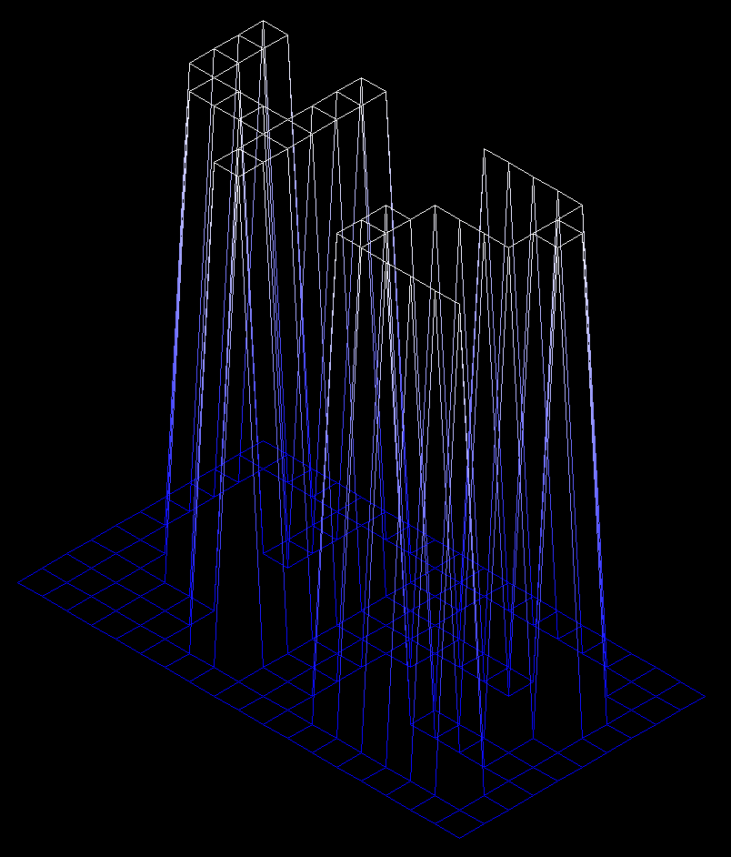
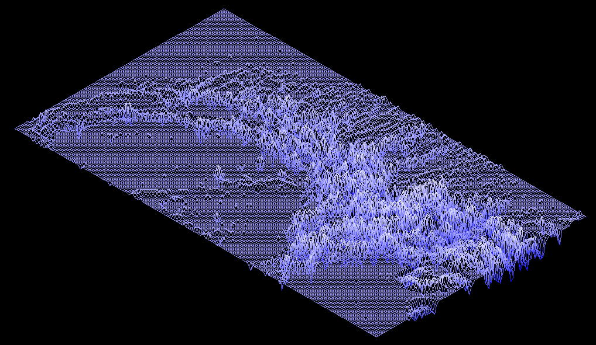
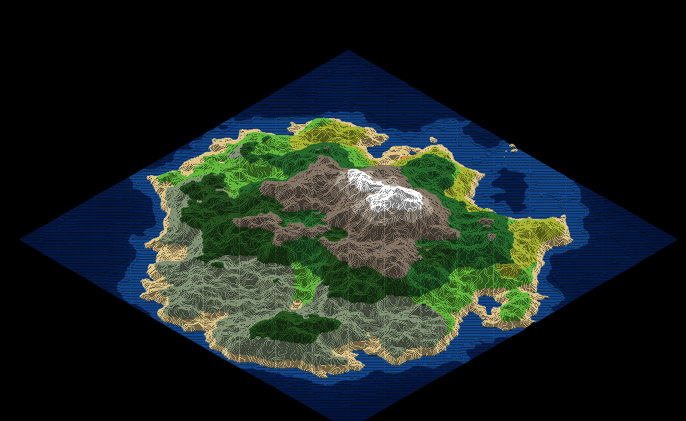
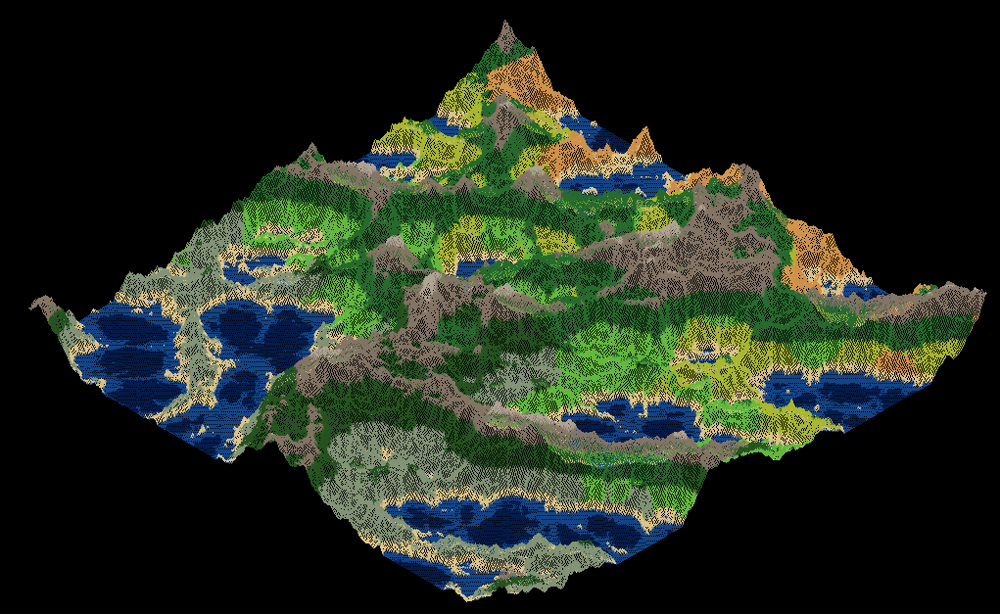
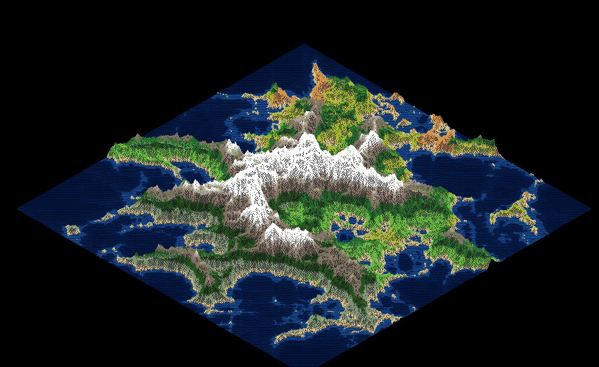
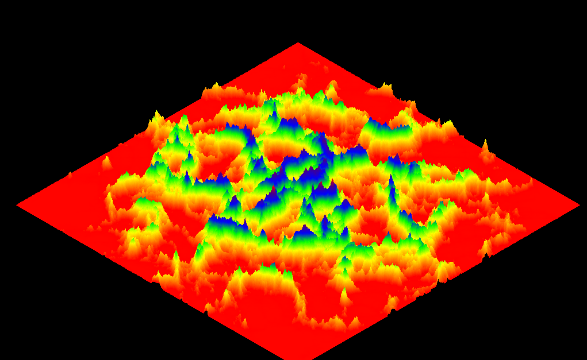

*This project has been created as part of the 42 curriculum by ntassin*

---

<div align="center">

```
███████╗██████╗ ███████╗
██╔════╝██╔══██╗██╔════╝
█████╗  ██║  ██║█████╗  
██╔══╝  ██║  ██║██╔══╝  
██║     ██████╔╝██║     
╚═╝     ╚═════╝ ╚═╝     
```

**Fil de Fer — Rendu 3D de terrain en wireframe**

*Un moteur 3D from-scratch en C : projection isométrique, tracé de lignes Bresenham,
contrôles en temps réel et un générateur de terrain procédural basé sur le bruit de Perlin.*

---


</div>

---

## Table des matières

- [C'est quoi FdF ?](#cest-quoi-fdf-)
- [Ce que ça fait](#ce-que-ça-fait)
- [Captures d'écran](#captures-décran)
- [Comment ça marche](#comment-ça-marche)
  - [Le parsing](#le-parsing)
  - [La projection isométrique](#la-projection-isométrique)
  - [L'algorithme de Bresenham](#lalgorithme-de-bresenham)
  - [L'interpolation de couleur](#linterpolation-de-couleur)
- [Le générateur de terrain procédural](#le-générateur-de-terrain-procédural)
  - [Bruit de Perlin](#bruit-de-perlin)
  - [Bruit fractal fBm](#bruit-fractal-fbm)
  - [Domain Warping](#domain-warping)
  - [Système de biomes](#système-de-biomes)
- [Installation](#installation)
- [Utilisation](#utilisation)
- [Contrôles](#contrôles)
- [Format de carte](#format-de-carte)
- [Structure du projet](#structure-du-projet)
- [Quelques choix techniques](#quelques-choix-techniques)

---

## C'est quoi FdF ?

FdF (Fil de Fer) est un projet graphique du cursus 42. Le principe : on lit un fichier
heightmap (une grille de nombres = des altitudes), et on affiche le tout en 3D sous forme
de wireframe avec une projection isométrique.

Chaque pixel écrit, chaque ligne tracée, chaque couleur interpolée — tout est fait à la main
en C pur. La seule dépendance externe c'est la MiniLibX, un wrapper X11 minimaliste fourni
par l'école.

La partie bonus est allée un peu plus loin : rotations libres, zoom à la molette, drag
à la souris, deux projections, un générateur de terrain procédural en jeu avec 5 presets
et 12 biomes. L'idée c'était de voir jusqu'où on pouvait pousser le projet.

---

## Ce que ça fait

### Partie obligatoire

| Fonctionnalité | Détails |
|----------------|---------|
| Parsing de heightmap | Lit les fichiers `.fdf`, toutes dimensions |
| Couleurs par sommet | Syntaxe `z,0xRRGGBB` optionnelle |
| Projection isométrique | Projection fixe classique à 30° |
| Tracé de lignes Bresenham | Pixel-perfect, 8 octants |
| Dégradé de couleur | Bleu (bas) → Blanc (haut) par défaut |
| Zoom et centrage automatiques | La carte tient toujours dans la fenêtre au démarrage |
| Gestion mémoire | Libération complète à la sortie |
| ESC / bouton fermer | Sortie propre |

### Partie bonus

| Fonctionnalité | Détails |
|----------------|---------|
| Rotation sur 3 axes | Rotation libre X / Y / Z avec matrices |
| Contrôle à la souris | Drag gauche = pan, drag droit = rotation, molette = zoom |
| Zoom | Touches `+`/`-` et molette souris (centré sur le curseur) |
| Déplacement | Touches directionnelles |
| Échelle Z | `[` / `]` pour exagérer ou aplatir l'altitude |
| Changement de projection | Bascule isométrique ↔ orthographique |
| 3 thèmes de couleur | Dégradé normal · Tout blanc · Arc-en-ciel |
| Rotation automatique | Rotation Y fluide avec `SPACE` |
| HUD | Affichage en temps réel du preset, taille, graine et FPS |
| Screenshot | `F12` sauvegarde un `.bmp` dans le dossier courant |
| **Générateur procédural** | Génération de terrain en jeu (voir ci-dessous) |
| 5 presets de terrain | Montagne · Île · Désert · Forêt · Fjords |
| 5 tailles de carte | 100² → 200² → 300² → 500² → 1000² |
| Seed aléatoire / incrémentale | `G` pour aléatoire, `N` pour seed+1 |

---

## Captures d'écran

| Carte classique | Heightmap Mars | Île générée |
|:-----------:|:--------------:|:----------------:|
|  |  |  |

| Montagnes générées | Fjords générés | Thème arc-en-ciel |
|:-------------------:|:----------------:|:-------------:|
|  |  |  |

---

## Comment ça marche

### Le parsing

Le parseur fait deux passes sur le fichier `.fdf`. C'est un peu verbeux mais c'est la
façon la plus propre de faire sans tout stocker en RAM d'un coup.

**Passe 1 — on mesure :**
```
count_cols_and_rows() → lit le fichier avec GNL
  ├── compte les lignes → height
  └── split de la 1ère ligne → width
```

**Passe 2 — on remplit :**
```
fill_map() → relit le fichier
  pour chaque ligne :
    ft_split(line, ' ') → tokens[]
    pour chaque token :
      parse_token() → extrait z et la couleur hex optionnelle
        ├── ft_strchr(token, ',') → y a-t-il une couleur ?
        ├── ft_atoi(avant la virgule) → valeur z
        └── parse_hex_color(après la virgule) → entier RGB
```

La carte est stockée dans deux tableaux `int **` parallèles :
- `map->z[row][col]` — l'altitude de chaque sommet
- `map->color[row][col]` — la couleur par sommet (`-1` = pas de couleur → on utilise le dégradé)

### La projection isométrique

La formule projette les coordonnées 3D de la grille sur l'écran 2D :

```
x_ecran = (col - row) × cos(30°) × zoom + x_off
y_ecran = (col + row) × sin(30°) × zoom − z × z_scale + y_off

cos(30°) ≈ 0.866  et  sin(30°) = 0.5
```

Ça place l'axe X vers le bas-droite et l'axe Y vers le bas-gauche — c'est ce qui donne
l'aspect de grille en losange caractéristique de la vue iso.

Dans le bonus, on applique trois rotations successives **avant** la formule iso :

```c
// Rotation Z (dans le plan de la grille) :
x' =  x·cos(rot_z) − y·sin(rot_z)
y' =  x·sin(rot_z) + y·cos(rot_z)

// Rotation X (inclinaison avant/arrière) :
y'' =  y'·cos(rot_x) − z·sin(rot_x)
z'  =  y'·sin(rot_x) + z·cos(rot_x)

// Rotation Y (rotation latérale) :
x'' =  x'·cos(rot_y) + z'·sin(rot_y)
z'' = −x'·sin(rot_y) + z'·cos(rot_y)
```

Le zoom de démarrage est calculé automatiquement pour que la carte tienne toujours dans
la fenêtre :
```c
span    = width + height
zoom    = min(WIN_W / (span × 0.866 × 1.2),
              WIN_H / (span × 0.5  × 1.4))
z_scale = zoom / (z_max − z_min) × 20.0
```

### L'algorithme de Bresenham

Bresenham trace une ligne pixel-perfect entre deux points en n'utilisant que des additions
entières — pas de flottants, pas de racine carrée :

```
Données P1 et P2 :
  dx = |P2.x − P1.x|,  dy = |P2.y − P1.y|
  sx = signe(P2.x − P1.x),  sy = signe(P2.y − P1.y)
  err = dx − dy

  pour chaque pixel jusqu'à P2 :
    dessine le pixel courant
    e2 = 2 × err
    si e2 > −dy : err −= dy ; x += sx   ← avance sur l'axe dominant
    si e2 <  dx : err += dx ; y += sy   ← avance sur l'axe secondaire
```

L'erreur accumulée mesure l'écart par rapport à la droite idéale. Quand elle dépasse un
seuil, l'algo avance dans la direction secondaire. Élégant et ultra-rapide.

### L'interpolation de couleur

Chaque ligne est dessinée avec un dégradé lisse entre ses deux extrémités.
À chaque étape `t ∈ [0.0, 1.0]` :

```c
R = R1 × (1−t) + R2 × t
G = G1 × (1−t) + G2 × t
B = B1 × (1−t) + B2 × t
couleur = (R << 16) | (G << 8) | B
```

Le dégradé d'altitude par défaut :
- `z_min` → `0x0000FF` (bleu profond)
- `z_max` → `0xFFFFFF` (blanc)

---

## Le générateur de terrain procédural

C'est la partie qui a pris le plus de temps, et clairement la plus fun à coder.
L'idée : générer du terrain réaliste à la volée depuis une graine, sans aucun asset
externe ni donnée précalculée.

### Bruit de Perlin

La base c'est le **gradient noise de Ken Perlin** (version améliorée 2002) :

1. **Table de permutation** — 256 entrées mélangées depuis la graine via un LCG
   (`rng = rng × 1664525 + 1013904223`), doublée à 512 pour éviter le modulo.

2. **Fonction de lissage** — `f(t) = 6t⁵ − 15t⁴ + 10t³`
   La courbe en S de Ken Perlin — plus douce que la cubique d'Hermite et sans artefacts
   de gradient visibles aux raccords.

3. **Gradients** — 4 vecteurs unitaires diagonaux (`±1, ±1`) sélectionnés via `hash & 3`.

4. **Interpolation bilinéaire** — les quatre gradients de coin sont mélangés
   selon la position fractionnaire lissée.

Sortie : un champ de bruit continu et lisse dans `[−1, 1]`.

### Bruit fractal fBm

Une seule couche de Perlin c'est trop lisse et uniforme. Le fBm superpose plusieurs
octaves pour ajouter du détail à toutes les échelles :

```
valeur = 0,  amplitude = 1,  fréquence = scale
pour i de 0 à octaves :
    valeur    += bruit(x × fréquence + i×19.19,
                       y × fréquence + i×47.47) × amplitude
    amplitude ×= persistence   ← chaque octave est plus discrète
    fréquence ×= lacunarity    ← chaque octave est plus fine
retourner normalisation vers [0, 1]
```

Les offsets `i×19.19` et `i×47.47` **décorrèlent les octaves** — sans eux, leurs maxima
s'alignent sur la même grille et ça se voit immédiatement.

**fBm ridgé** (pour les montagnes et fjords) :

```
Au lieu de : n = bruit(...)
On utilise : n = 1 − |bruit(...)| × 1.5   ← les passages par zéro deviennent des crêtes
             n = max(0, n)
             valeur += n × n × amplitude   ← le carré creuse les vallées
```

Le résultat : des bosses douces deviennent des arêtes alpines vives.

### Domain Warping

Avant d'échantillonner le bruit de terrain, les coordonnées elles-mêmes sont tordues
par **deux champs fBm indépendants** :

```
warp_x = fbm(x,       y      )
warp_y = fbm(x + 5.2, y + 1.3)
hauteur = bruit(x + warp_x × force,
                y + warp_y × force)
```

L'offset `+5.2 / +1.3` brise la symétrie entre les deux axes de déformation.
Sans domain warping, les côtes sont trop rondes et propres. Avec, on obtient des fjords,
des méandres, des formes organiques qui ressemblent à de vraies cartes.

### Système de biomes

Chaque cellule reçoit un biome selon son **altitude** et sa **température calculée** :

**Modèle de température :**
```
latitude  = 1.0 − y / hauteur          (nord = plus chaud dans ce modèle)
altitude  = −h × 0.4                   (plus haut = plus froid)
dérive    = bruit_lent(x, y) × 0.25    (fronts climatiques)
temp      = latitude + altitude + dérive
```

**Attribution des 12 biomes :**

```
h < 0.28               → OCÉAN PROFOND   (bleu marine foncé)
h < 0.38  (SEA_LEVEL)  → OCÉAN           (bleu)
h < 0.43               → PLAGE           (sable)
h > 0.94               → NEIGE           (blanc)
h > 0.86               → HAUTE MONTAGNE  (gris-blanc)
h > 0.72               → MONTAGNE        (gris-brun)
sinon, selon la température :
  temp < 0.18, h élevé → TAÏGA           (vert sombre)
  temp < 0.18          → TOUNDRA         (vert terne)
  temp > 0.70          → DÉSERT          (orange-brun)
  temp > 0.50, h élevé → FORÊT           (vert profond)
  temp > 0.50          → SAVANE          (vert-jaune)
  h élevé              → FORÊT
  sinon                → PLAINES         (vert vif)
```

Chaque biome a deux couleurs (basse et haute), interpolées selon l'altitude normalisée
dans ce biome — ça évite les transitions brutales entre zones.

**Les 5 presets :**

| # | Preset | Algorithme | Octaves | Warp | Résultat |
|---|--------|-----------|---------|------|----------|
| 1 | Montagne | fBm ridgé | 7 | 0.0 | Arêtes alpines vives |
| 2 | Île | fBm + masque radial | 5 | 1.2 | Atoll tropical |
| 3 | Désert | fBm classique | 3 | 1.5 | Dunes douces |
| 4 | Forêt | fBm persistence élevée | 4 | 0.5 | Collines verdoyantes |
| 5 | Fjords | Ridgé + masque | 7 | 4.5 | Côtes nordiques déchirées |

**I/O rapide :** le générateur écrit le fichier `.fdf` via des `write()` bruts avec des
sérialiseurs entiers/hex codés à la main (`append_int`, `append_hex`). Pas de `printf`,
pas de `malloc` dans le chemin critique — une carte 1000×1000 s'écrit en quelques secondes.

---

## Installation

### Dépendances

- `gcc` ou `cc`
- `make`
- En-têtes de développement X11 (`libx11-dev`, `libxext-dev` sur Debian/Ubuntu)
- `libm` (standard sur tous les systèmes Linux)

```bash
# Debian / Ubuntu
sudo apt-get install gcc make libx11-dev libxext-dev
```

### Compilation

```bash
git clone <url-du-depot> fdf
cd fdf

make          # compile ./fdf (partie obligatoire)
make bonus    # compile ./fdf_bonus (partie bonus)
make re       # recompilation complète
make fclean   # supprime tous les binaires et objets
```

Le Makefile compile **libft** et **MiniLibX** automatiquement si nécessaire.

---

## Utilisation

```bash
# Partie obligatoire
./fdf <chemin/vers/carte.fdf>

# Partie bonus
./fdf_bonus <chemin/vers/carte.fdf>
```

**Cartes de test incluses :**

```bash
./fdf maps/test_maps/42.fdf
./fdf maps/test_maps/mars.fdf
./fdf maps/test_maps/julia.fdf
./fdf maps/test_maps/elem-col.fdf   # couleurs par sommet
./fdf maps/test_maps/100-6.fdf      # grande carte

./fdf_bonus maps/test_maps/mars.fdf
# Puis appuyez sur 1-5 pour générer des terrains procéduraux directement
```

---

## Contrôles

### Partie obligatoire
| Touche | Action |
|--------|--------|
| `ESC` | Quitter |
| Bouton fermer | Quitter |

### Bonus — Caméra
| Touche / Action | Résultat |
|-----------------|----------|
| Touches directionnelles | Déplacement (pan) |
| Clic gauche + drag | Déplacement (pan) |
| `+` / `-` | Zoom avant / arrière |
| Molette souris | Zoom avant / arrière (centré sur le curseur) |
| `[` / `]` | Augmenter / diminuer l'échelle Z |
| `R` | Réinitialiser la caméra |

### Bonus — Rotation
| Touche / Action | Résultat |
|-----------------|----------|
| `W` / `S` | Rotation autour de l'axe X |
| `A` / `D` | Rotation autour de l'axe Y |
| `Q` / `E` | Rotation autour de l'axe Z |
| Clic droit + drag | Rotation libre X / Y |
| `SPACE` | Activer/désactiver la rotation automatique |

### Bonus — Affichage
| Touche | Action |
|--------|--------|
| `P` | Changer de projection (isométrique ↔ orthographique) |
| `C` | Changer de thème de couleur (normal → blanc → arc-en-ciel) |
| `F12` | Sauvegarder un screenshot `screenshot.bmp` |

### Bonus — Générateur de terrain
| Touche | Action |
|--------|--------|
| `1` | Preset : Montagne |
| `2` | Preset : Île |
| `3` | Preset : Désert |
| `4` | Preset : Forêt |
| `5` | Preset : Fjords |
| `TAB` | Changer la taille (100² → 200² → 300² → 500² → 1000²) |
| `G` | Nouvelle graine aléatoire |
| `N` | Graine + 1 (variation subtile) |

---

## Format de carte

Un fichier `.fdf` c'est juste une grille texte, une valeur par sommet :

```
0  0  0  0  0
0  5 10  5  0
0 10 20 10  0
0  5 10  5  0
0  0  0  0  0
```

- Chaque **ligne** du fichier = une rangée dans la grille 3D (axe Y)
- Chaque **nombre** = une colonne (axe X), sa valeur est l'altitude (Z)
- Les valeurs sont séparées par des espaces
- Les valeurs négatives sont supportées

**Couleurs par sommet** en notation hexadécimale (optionnel) :

```
0,0xFF0000  0,0x00FF00  0,0x0000FF
5,0xFFFF00  10,0xFF00FF 5,0x00FFFF
0,0xFFFFFF  0,0x888888  0,0x000000
```

Syntaxe : `z,0xRRGGBB` — la virgule sépare l'altitude de la couleur.
Les sommets sans couleur utilisent le dégradé automatique par altitude.

---

## Structure du projet

```
fdf/
├── Makefile
│
├── include/
│   ├── fdf.h                    # Partie obligatoire : structs + prototypes
│   └── bonus/
│       ├── fdf_bonus.h          # Bonus : structs + prototypes
│       └── mapgen_bonus.h       # Générateur : structs + prototypes
│
├── src/
│   ├── main.c                   # Point d'entrée, init, mlx_loop
│   ├── parse.c                  # Comptage des dimensions, parsing des tokens
│   ├── parse2.c                 # Allocation et remplissage de la carte
│   ├── projection.c             # Projection isométrique, zoom automatique
│   ├── draw.c                   # Bresenham, put_pixel, map_to_screen
│   ├── draw2.c                  # Boucle principale draw_map()
│   ├── events.c                 # key_hook, close_hook, quit
│   ├── utils.c                  # error_exit, free_map, lerp_color
│   │
│   └── bonus/
│       ├── main_bonus.c         # Point d'entrée avec hooks souris + boucle
│       ├── parse_bonus.c        # (même logique, header bonus)
│       ├── parse2_bonus.c
│       ├── projection_bonus.c   # Rotation 3 axes + projection parallèle
│       ├── draw_bonus.c         # Bresenham + put_pixel (bonus)
│       ├── draw2_bonus.c        # Couleur, map_to_screen, HUD
│       ├── draw3_bonus.c        # Boucle principale draw_map()
│       ├── events_bonus.c       # loop_hook, redraw, quit
│       ├── mouse_bonus.c        # Hooks souris : pan, rotation, zoom, release
│       ├── keys_bonus.c         # Tous les handlers clavier + déclenchement mapgen
│       ├── color_bonus.c        # rainbow_color(), getters fdf_theme/preset/size
│       ├── utils_bonus.c        # Utilitaires communs
│       ├── screenshot_bonus.c   # Sauvegarde BMP via write() direct
│       ├── perlin_bonus.c       # Implémentation du bruit de Perlin
│       ├── fbm_bonus.c          # fBm, bruit ridgé, domain warp, masque île
│       ├── biome_bonus.c        # Modèle de température + 12 biomes
│       ├── mapgen_bonus.c       # 5 presets de terrain
│       └── mapgen_write_bonus.c # Écriture du .fdf sans malloc ni printf
│
├── GNL/
│   ├── get_next_line.c          # Lecteur de fichier ligne par ligne
│   ├── get_next_line_utils.c
│   └── get_next_line.h
│
├── libft/                       # Bibliothèque C personnalisée
├── minilibx-linux/              # MiniLibX (graphismes X11)
└── maps/test_maps/              # Heightmaps de test fournis
    ├── 42.fdf
    ├── mars.fdf
    ├── julia.fdf
    ├── elem-col.fdf             # Couleurs par sommet
    ├── 100-6.fdf                # Grande carte
    └── ...
```

---

## Quelques choix techniques

**Accès direct au framebuffer.**
Les pixels sont écrits directement dans la mémoire de l'image MiniLibX
(`addr + y × line_len + x × bpp/8`) au lieu d'appeler `mlx_pixel_put`.
La différence : `mlx_pixel_put` flush X11 à chaque appel. Sur une image pleine,
c'est des milliers d'appels système par frame — impraticable. Un seul `mlx_put_image_to_window`
en fin de draw et c'est fluide.

**Deux passes de parsing.**
On ouvre le fichier deux fois — une fois pour compter les dimensions, une fois pour remplir.
C'est un peu moins élégant qu'un seul passage, mais ça évite de tout stocker en mémoire
intermédiaire avant d'allouer la grille finale. La norme 42 et GNL n'aident pas non plus à
faire du parsing en un coup.

**Générateur sans printf ni malloc dans le chemin critique.**
Écrire une carte 1000×1000 via `fprintf` serait lent. Le générateur construit chaque ligne
dans un buffer de 64 Ko sur la pile et fait un seul `write()` par ligne avec des fonctions
`append_int` et `append_hex` codées à la main. Sur une grosse map, ça se voit.

**Décorrélation des octaves fBm.**
Chaque octave est échantillonnée avec un offset spatial différent (`i × 19.19`, `i × 47.47`).
Sans ça, toutes les octaves partagent la même origine et leurs extrema s'alignent — on voit
des artefacts de grille dans le terrain généré, surtout sur les grandes maps.

**Rotation recentrée.**
Quand on tourne à la souris (clic droit + drag), le centre de la map reste au même endroit
à l'écran. Ça se fait en projetant le centre avant et après la rotation, et en compensant
l'offset. Sans ça, la map dérive à chaque rotation et c'est vite inutilisable.

**Cache trigonométrique.**
La projection isométrique bonus applique 3 rotations 3D : `iso_project` avait besoin de
`cos`/`sin` 6 fois par point. Sur une map 1000×1000 c'est 6 000 000 appels à des fonctions
flottantes par frame. La solution : `update_trig` précalcule les 6 valeurs en tout début
de `draw_map` et les stocke dans `t_cam`. Toute la boucle de dessin lit ces caches — zéro
appel trig pendant le rendu.

**Buffer de rangée (double-buffer pattern).**
La version naïve de `draw_map` appelle `iso_project` 3 fois par point (segment horizontal,
vertical, et depuis la rangée suivante). En allouant deux buffers d'une rangée (`cur`/`nxt`)
et en ne remplissant `nxt` qu'une fois avant de swapper, chaque point est projeté exactement
une fois — 1 000 000 projections au lieu de 3 000 000 sur une map 1000×1000.

**Skip des segments sous-pixel.**
À petit zoom, beaucoup de points voisins projettent sur le même pixel. Appeler `draw_line`
pour un segment de longueur nulle dessine un pixel déjà dessiné sans rien apporter. Un test
simple `p.x == q.x && p.y == q.y` avant chaque appel filtre ces cas et économise des
millions d'itérations Bresenham inutiles sur les grandes maps dézoomées.

**Struct `t_fdf` compactée avec bitmask.**
7 champs `int` booléens ou petits entiers (`dirty`, `auto_rotate`, `is_dragging`,
`is_rotating`, `color_theme`, `preset_id`, `size_id`) ont été regroupés en un seul `int flags`.
Les opérations bitwise (`|=`, `&=~`, `^=`) remplacent les affectations simples et les
getters `fdf_theme/preset/size` extraient les valeurs multi-bits. En bonus : moins de champs
à déclarer dans la struct, ce qui aide à rester conforme à la norme 42.

---

<div align="center">

*Fait avec ❤️ à 42 — par ntassin*

</div>
